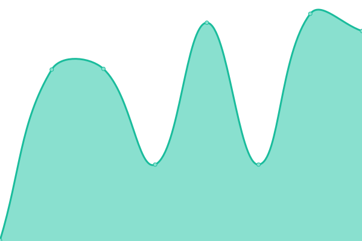
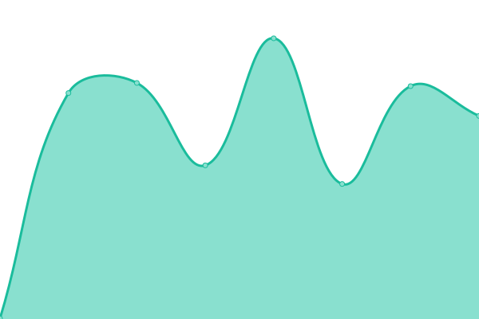
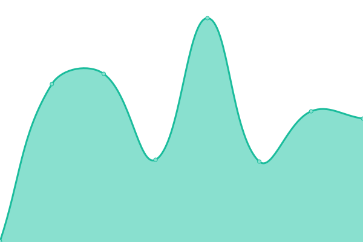
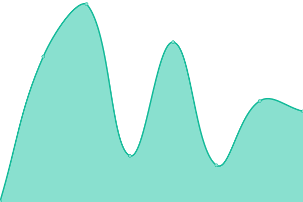

# [📈 Live Status](https://corpomixnds.github.io/upptime): <!--live status--> **🟩 All systems operational**

This repository contains the open-source uptime monitor and status page for [corpomixnds](https://corpomixnds.github.io/upptime), powered by [Upptime](https://github.com/upptime/upptime).

With [Upptime](https://upptime.js.org), you can get your own unlimited and free uptime monitor and status page, powered entirely by a GitHub repository. We use [Issues](https://github.com/corpomixnds/upptime/issues) as incident reports, [Actions](https://github.com/corpomixnds/upptime/actions) as uptime monitors, and [Pages](https://corpomixnds.github.io/upptime) for the status page.

<!--start: status pages-->
<!-- This summary is generated by Upptime (https://github.com/upptime/upptime) -->
<!-- Do not edit this manually, your changes will be overwritten -->
<!-- prettier-ignore -->
| URL | Status | History | Response Time | Uptime |
| --- | ------ | ------- | ------------- | ------ |
|  [Vive Norte Frontend](https://vivenortedesantander.com.co) | 🟩 Up | [vive-norte-frontend.yml](https://github.com/corpomixnds/upptime/commits/HEAD/history/vive-norte-frontend.yml) | 

 328ms
     
 | 

<a href="https://corpomixnds.github.io/upptime/history/vive-norte-frontend">100.00%</a>
    

|  [Vive Norte API](https://corpomixnds-backend-q34sb.ondigitalocean.app/api/v1/historical_routes) | 🟩 Up | [vive-norte-api.yml](https://github.com/corpomixnds/upptime/commits/HEAD/history/vive-norte-api.yml) | 

 411ms
     
 | 

<a href="https://corpomixnds.github.io/upptime/history/vive-norte-api">100.00%</a>
    

|  [Vive Norte Maps](https://maps.vivenortedesantander.com.co) | 🟩 Up | [vive-norte-maps.yml](https://github.com/corpomixnds/upptime/commits/HEAD/history/vive-norte-maps.yml) | 

 267ms
     
 | 

<a href="https://corpomixnds.github.io/upptime/history/vive-norte-maps">100.00%</a>
    

|  [Vive Norte OSRM](https://osrm.vivenortedesantander.com.co/route/v1/driving/-72.49939892298482,7.883757374457861;-72.50015034564491,7.884847252079377?steps=true&alternatives=false&overview=full) | 🟩 Up | [vive-norte-osrm.yml](https://github.com/corpomixnds/upptime/commits/HEAD/history/vive-norte-osrm.yml) | 

 249ms
     
 | 

<a href="https://corpomixnds.github.io/upptime/history/vive-norte-osrm">100.00%</a>
    

<!--end: status pages-->

[**Visit our status website →**](https://corpomixnds.github.io/upptime)

## 📄 License

- Powered by: [Upptime](https://github.com/upptime/upptime)
- Code: [MIT](./LICENSE) © [corpomixnds](https://corpomixnds.github.io/upptime)
- Data in the `./history` directory: [Open Database License](https://opendatacommons.org/licenses/odbl/1-0/)
